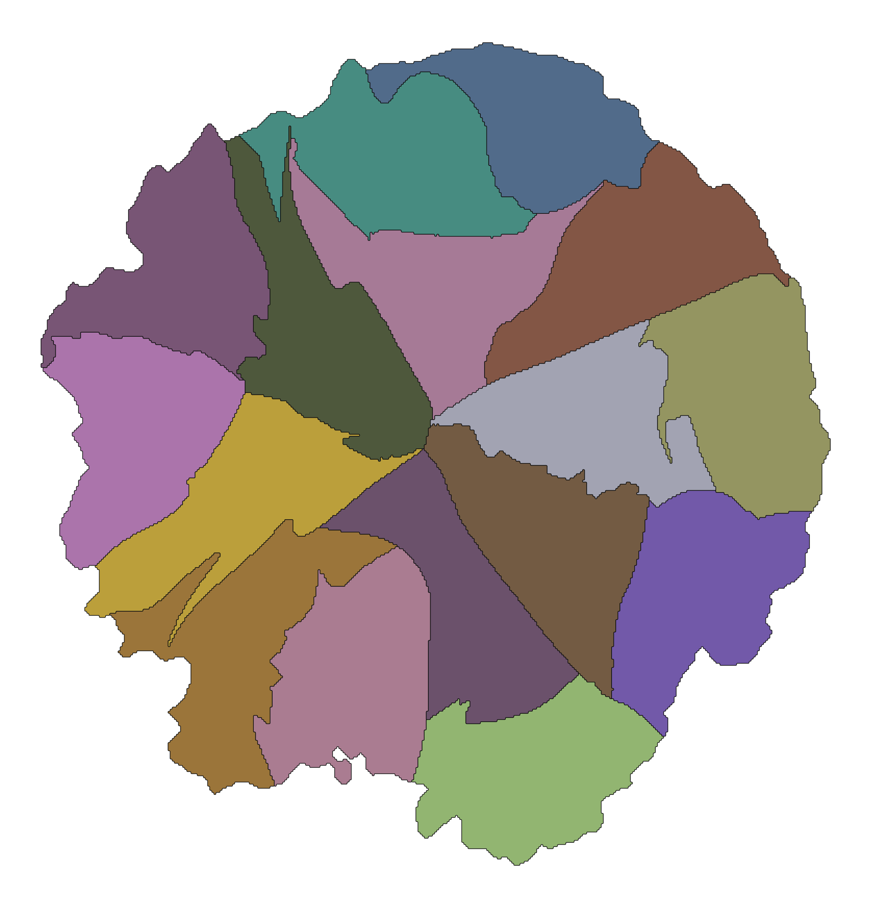

# DCEL Map Generator

Generate whimsical continent-style maps from a rooted hierarchy and export them as:

- a leaf-level DCEL
- a rendered preview image
- a frontend-ready bundle for an interactive zoomable map

This repo is the reusable core. Domain-specific map projects can keep their own hierarchy data and consume this generator/render stack.

[Live Demo](https://alonso-cancino.github.io/map-generator/)



## What It Does

The pipeline is tree-first:

1. load a rooted hierarchy from `examples/atlantis/zone_edges.json`
2. generate a continent mask
3. recursively partition each parent region among its children
4. extract leaf polygons from the raster partition
5. build a DCEL and optional frontend bundle

The bundled demo dataset is a small fantasy world centered on **Atlantis** so you can run the project immediately without bringing your own taxonomy first.

## Quickstart

Requirements:

- Python 3.11+
- `uv`
- Node.js 20+ for the frontend demo

Install Python dependencies:

```bash
uv sync --dev
```

Generate the demo outputs:

```bash
uv run python -m dcel_builder \
  --zone-edges examples/atlantis/zone_edges.json \
  --tree-stats examples/atlantis/zone_tree_stats.json \
  --zone-index examples/atlantis/zone_index.json \
  --output dcel_map.json \
  --render \
  --render-output docs/atlantis-map.png \
  --frontend-bundle frontend/public/map_bundle.json \
  --validate
```

Run the interactive renderer locally:

```bash
cd frontend
npm install
npm run dev
```

Open `http://localhost:5173/`.

## Input Files

The generator expects three JSON files:

- `zone_edges.json`: directed `[parent, child]` pairs forming a rooted tree
- `zone_index.json`: `{ "id": "name" }` mapping used for labels/tooling
- `zone_tree_stats.json`: optional sidecar metadata; the generator currently tolerates an empty object

The bundled example describes a three-level fantasy continent:

- `Atlantis`
- major regions such as `Aurelia Reach`, `Tidehollow`, `Cinder Crown`, `Mistwood`
- smaller subregions and leaf territories beneath them

The tracked demo inputs live in [`examples/atlantis`](/home/alosc/proyectos/map/examples/atlantis). Private or domain-specific datasets can stay in ignored folders such as `local/`.

## Outputs

- `dcel_map.json`: serialized DCEL
- `docs/atlantis-map.png`: static render
- `frontend/public/map_bundle.json`: interactive bundle consumed by the frontend

## GitHub Pages Demo

The frontend is configured for GitHub Pages static hosting. A workflow in `.github/workflows/deploy-pages.yml` builds `frontend/` and publishes the interactive demo using the bundled Atlantis example.

## Versioning

This project uses Semantic Versioning and derives releases from commits on `main`.

- `BREAKING CHANGE` in a commit body, or `type!:` in the subject, increments `MAJOR`
- subjects starting with `feat`, `add`, or `implement` increment `MINOR`
- all other changes increment `PATCH`

The automation writes the chosen version into Python and frontend package metadata, commits `Release vX.Y.Z`, and creates the matching `vX.Y.Z` tag.

## Releases

Pushing to `main` triggers the semantic version workflow in `.github/workflows/semver-release.yml`. That workflow computes the next version, commits the versioned files, and pushes the matching release tag. The tag then triggers `.github/workflows/release.yml`.

Each release publishes consumable artifacts:

- Python source distribution and wheel from `dist/`
- a production frontend archive, `frontend-dist.tar.gz`
- an npm package tarball for the renderer, `alonso-cancino-dcel-map-frontend-<version>.tgz`
- the example frontend bundle, `map_bundle.json`
- the Atlantis example inputs as `atlantis-example-inputs.tar.gz`
- the demo screenshot, `atlantis-map.png`

You can consume the renderer package from npm by installing the published tarball, or later from the npm registry once it is published there. The library entrypoint exports `MapView`, `loadBundle`, `parseBundle`, and the bundle/type definitions.

When the repository is configured for trusted publishing, the same release workflow also publishes:

- the Python package to PyPI
- the renderer package to npm

### One-time registry setup

To make automated publishing work, you still need to configure each registry once:

1. PyPI:
Create the `dcel-map-generator` project on PyPI, then add a Trusted Publisher for this GitHub repository and the workflow file `release.yml`.

2. npm:
Create the `@alonso-cancino/dcel-map-frontend` package on npm, then add a Trusted Publisher for this GitHub repository and the workflow file `release.yml`.

3. GitHub:
If you want deployment protection, create `pypi` and `npm` environments in the repository settings to match the workflow.

After that, pushing to `main` will create the next semantic version release and publish both packages automatically.

## Development

```bash
uv run pytest
uv run ruff check .
cd frontend && npm run build
```

Contributor conventions live in `AGENTS.md`.

## License

MIT. See [LICENSE](LICENSE).
